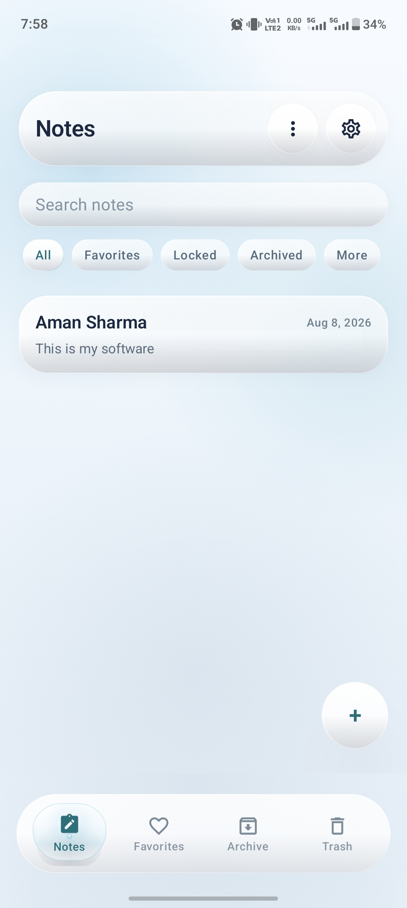
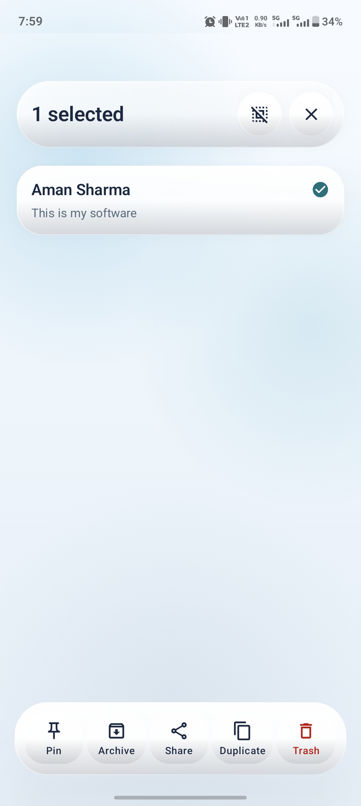
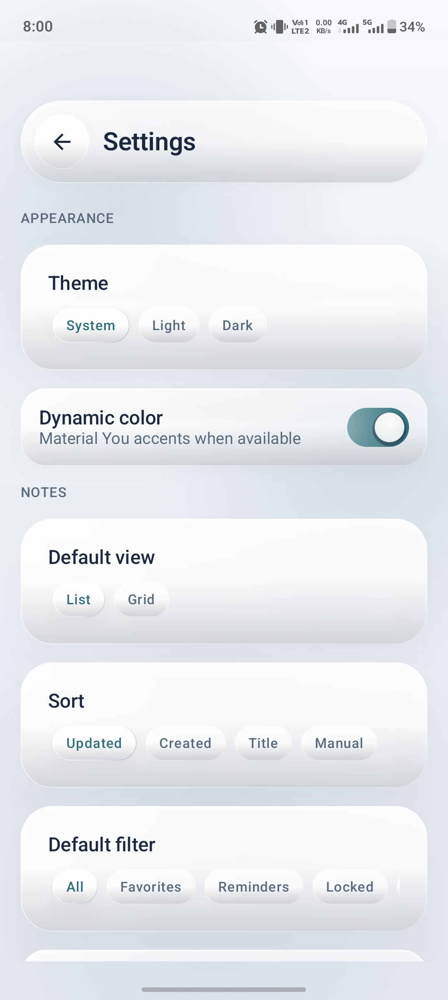
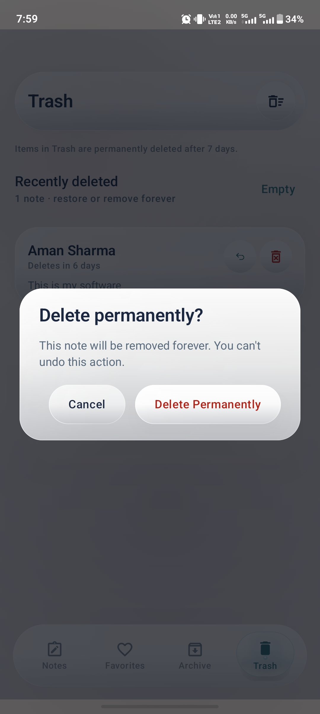
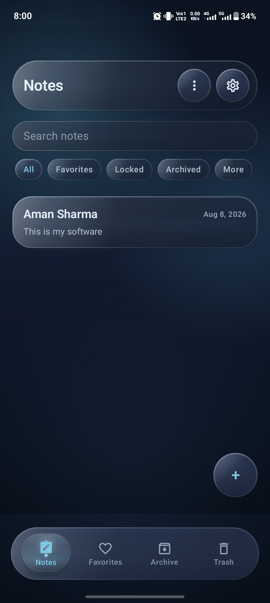
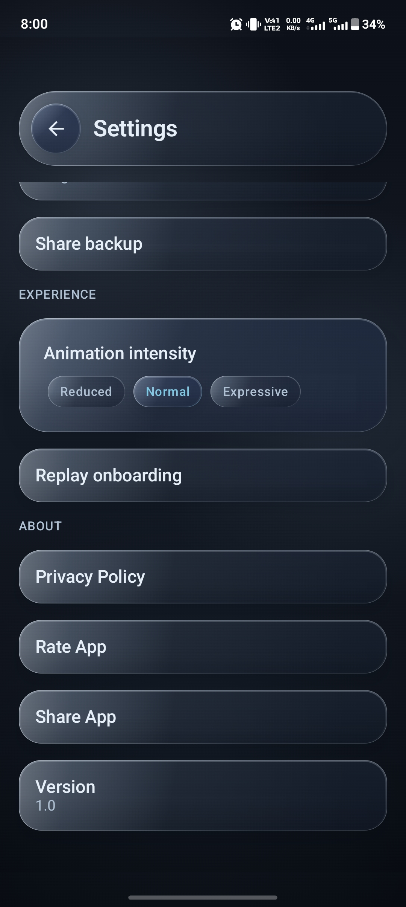

# Liquid Glass Notebook

A modern Android notebook app focused on a clean, flexible note-taking experience with a custom Liquid Glass interface.

## Overview

Liquid Glass Notebook is a feature-rich Android notebook application designed with a modern UI and smooth interactions.

## Project Details

- Package Name: `com.notepad.glass.nine`
- Status: Client Project — UI, features, and availability may change in the future.

The project focuses on:

- Clean and responsive UI
- Custom Liquid Glass design system
- Light and dark themes
- Flexible note organization
- Customizable app settings
- Smooth animations and transitions
- Responsive layouts across different screen sizes

## Screenshots

<table>
<tr>
<td></td>
<td></td>
<td></td>
</tr>
<tr>
<td></td>
<td></td>
<td></td>
</tr>
</table>

> The UI is designed to adapt across different Android screen sizes and form factors.

For the complete collection of screenshots, visit the [screenshots folder](screenshots/).

## Features

### Notes

- Create and manage notes
- Search notes
- Favorites
- Locked notes
- Archived notes
- Pin notes
- Duplicate notes
- Share notes
- Delete and restore notes
- Trash management
- Permanent deletion with confirmation

### Organization

- List and grid views
- Multiple sorting options
- Custom default filters
- Favorites
- Archive
- Trash
- Manual organization

### Customization

- System, Light, and Dark themes
- Material You dynamic colors
- Custom Liquid Glass interface
- Adjustable animation intensity
- Responsive layouts
- Smooth UI interactions

### App Settings

- Default note view
- Sorting preferences
- Default filters
- Theme preferences
- Dynamic color support
- Animation intensity
- Backup sharing
- Onboarding replay
- Privacy Policy
- App sharing
- App rating
- Version information

## Design

The interface is built around a custom Liquid Glass visual system with:

- Translucent surfaces
- Soft depth and elevation
- Rounded components
- Subtle borders
- Layered backgrounds
- Light and dark appearances
- Consistent spacing and typography
- Animated interactions

The goal was to keep the interface visually rich while maintaining usability and consistency throughout the app.

## Tech Stack

- Kotlin
- Jetpack Compose
- Android SDK
- Material Design 3
- MVVM Architecture
- Kotlin Coroutines
- Modern Android UI components
- Custom Liquid Glass UI components
- Responsive Compose layouts

